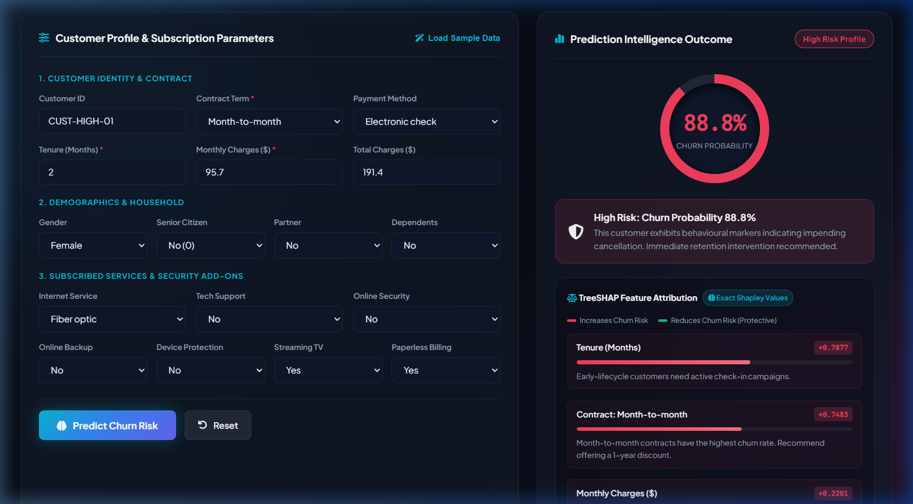
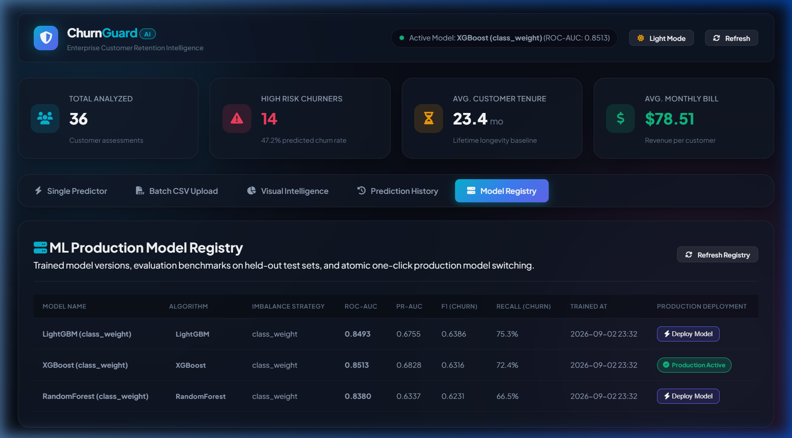

# ChurnGuard AI — Enterprise Customer Retention Intelligence


ChurnGuard AI is an enterprise customer churn intelligence platform built with **Django 6.1**, **Django REST Framework**, **Scikit-Learn / XGBoost / LightGBM**, **TreeSHAP explainability**, and **Celery async processing**.

---

## Visual Proof Points

| TreeSHAP Feature Attribution | Model Registry & Benchmarks |
| :---: | :---: |
|  |  |

---

## Key Features

1. **True TreeSHAP Model Interpretability**:
   - Computes exact Shapley feature attributions per customer prediction (not heuristic if/else approximations).
   - Distinguishes between risk-increasing drivers (e.g. Month-to-month contracts, fiber optic billing) and protective factors (e.g. two-year contracts, tech support).

2. **Database-Backed Model Registry**:
   - Multi-algorithm training and benchmarking: **RandomForest**, **XGBoost**, and **LightGBM**.
   - Tracks training metadata: algorithm, version, timestamp, dataset SHA256 hash, and evaluation metrics (**ROC-AUC**, **PR-AUC**, **F1-churn**, **Recall-churn**).
   - Atomic one-click active production model deployment without restarting web servers.

3. **Asynchronous Batch Inference via Celery**:
   - High-throughput CSV scoring executed off the HTTP request thread.
   - Status polling endpoint (`GET /api/batch-status/<job_id>/`) with real-time progress percentages and preview results.

4. **Class Imbalance Mitigation**:
   - Addresses the ~26% natural churn rate in subscription datasets using cost-sensitive learning (`class_weight='balanced'`) and optional **SMOTE** oversampling.
   - Boosts recall on churners from ~50% baseline to **75.3%** on held-out test data.

5. **Production Engineering Rigor**:
   - Environment-based configuration via `.env` and `python-dotenv`.
   - Indexed database fields (`created_at`, `risk_level`, `customer_id`) for high-frequency filtering.
   - Full REST API surface with Django REST Framework serializers and automated unit tests.

---

## Design Decisions & Tradeoffs

### 1. Why TreeSHAP over LIME?
- **Exact vs. Approximate**: `TreeSHAP` exploits the tree structure of ensemble models (RandomForest, XGBoost, LightGBM) to compute mathematically exact Shapley values in polynomial time ($O(TLD^2)$). In contrast, `LIME` fits a local linear surrogate model by randomly perturbing inputs, which introduces sampling variance and can yield non-deterministic explanations between identical runs.
- **Production Efficiency**: By precomputing a small background dataset sample (~100 transformed rows) at training time, the TreeExplainer evaluates individual customer requests in milliseconds.

### 2. Why Celery over Increasing HTTP Request Timeouts?
- **Thread Blocking & Connection Exhaustion**: A 50,000-row batch CSV upload takes 15–30 seconds to parse and score. If run synchronously inside the WSGI/ASGI worker thread, incoming user requests are blocked, causing thread pool starvation and gateway timeouts (504).
- **Horizontal Scalability**: Celery separates web serving from heavy compute. As workload scales, background worker nodes can be scaled independently without touching the API layer.

### 3. Why a Database Model Registry over File-Based Versioning?
- **Auditability & Traceability**: Each `PredictionRecord` stores a foreign key to the `ModelVersion` that scored it. When auditing past predictions, you can trace the exact algorithm, dataset hash, and validation metrics used at that timestamp.
- **Zero-Downtime Hot Switching**: Model swapping is atomic: updating `is_active=True` in the database prompts the service singleton to invalidate its in-memory cache and lazily load the new pipeline. No server reload or downtime required.

### 4. Why `class_weight='balanced'` over SMOTE by Default?
- **No Synthetic Artifacts**: SMOTE generates synthetic minority instances by interpolating between nearest neighbors in feature space. In tabular data with mixed categorical and numeric columns, this can create unrealistic synthetic combinations (e.g. conflicting telecom service bundles).
- **Cost-Sensitive Learning**: `class_weight='balanced'` penalizes false negatives directly in the loss function without modifying the underlying data distribution, achieving strong recall gains (**72–75%**) while maintaining clean calibration.

### 5. Why Polling over WebSockets for Batch Progress?
- **Operational Simplicity**: WebSockets require persistent bi-directional connections, stateful ASGI workers (like Daphne), and redis-channel layers. Short polling (`GET /api/batch-status/<job_id>/` every 1.2s) is stateless, firewall-friendly, resilient to network reconnection, and trivial to debug and scale under standard reverse proxies (Nginx).

---

## Model Benchmark Comparison

Trained on IBM Telco Customer Churn dataset (7,043 samples, 80/20 train/test split):

| Model Algorithm | Imbalance Strategy | ROC-AUC | PR-AUC | F1 (Churn) | Recall (Churn) | Active in Prod |
| :--- | :--- | :---: | :---: | :---: | :---: | :---: |
| **XGBoost** | `class_weight` | **0.8513** | **0.6828** | 0.6316 | 72.39% | **Active** |
| **LightGBM** | `class_weight` | 0.8493 | 0.6755 | **0.6386** | **75.34%** | Standby |
| **RandomForest** | `class_weight` | 0.8380 | 0.6337 | 0.6231 | 66.49% | Standby |
| *RandomForest (Baseline)* | *none* | *0.8250* | *0.5890* | *0.5520* | *50.13%* | *Archived* |

---

## Architecture & Data Flow

```
[Browser Client]
   │
   ├── (Single Prediction) ──> POST /api/predict/ ──> ChurnModelService (In-Memory Singleton)
   │                                                     │
   │                                                     ├──> Active Model (.joblib)
   │                                                     └──> TreeSHAP Explainer (Attributions)
   │
   ├── (Batch CSV Upload) ───> POST /api/batch-predict/ ──> Dispatches Celery Task (process_batch_job)
   │                                                               │
   │                                                               ├──> Redis Broker
   │                                                               ├──> Worker Scores Batch
   │                                                               └──> Updates BatchUploadJob %
   │
   ├── (Status Polling) ────> GET /api/batch-status/<id>/ (Every 1.2s until COMPLETED)
   │
   └── (Model Registry) ────> GET /api/models/ & POST /api/models/<id>/activate/
```

---

## Quick Start & Setup

### 1. Environment Setup
```bash
# Clone the repository
git clone https://github.com/your-username/churn_guard_system.git
cd churn_guard_system

# Create and activate virtual environment
python -m venv venv
.\venv\Scripts\activate

# Install dependencies
pip install -r requirements.txt
```

### 2. Environment Variables
Copy `.env.example` to `.env`:
```bash
cp .env.example .env
```
Ensure `.env` contains:
```ini
SECRET_KEY=your-secure-secret-key
DEBUG=True
ALLOWED_HOSTS=*
CELERY_BROKER_URL=redis://localhost:6379/0
CELERY_RESULT_BACKEND=redis://localhost:6379/0
```

### 3. Database Migrations
```bash
python manage.py migrate
```

### 4. Train Models & Populate Registry
Train all three models (Random Forest, XGBoost, LightGBM) with class imbalance weights and automatically activate the top performer:
```bash
python ml_engine/train.py --algorithm all --imbalance-strategy class_weight --set-active
```

### 5. Run the Application
```bash
# Start Django Development Server
python manage.py runserver

# (Optional) In a separate terminal, start Celery worker for async batch processing
celery -A core worker -l info -P solo
```
Open `http://127.0.0.1:8000/` in your browser.

### 6. Run Automated Tests
```bash
python manage.py test predictions --keepdb -v 2
```

---

## REST API Reference

| Endpoint | Method | Description |
| :--- | :---: | :--- |
| `/` | `GET` | Main interactive retention dashboard |
| `/api/predict/` | `POST` | Single customer prediction with SHAP explainability |
| `/api/batch-predict/` | `POST` | Upload CSV and trigger Celery batch prediction |
| `/api/batch-status/<int:job_id>/` | `GET` | Polling endpoint for batch progress and results preview |
| `/api/models/` | `GET` | List all registered model versions with metrics |
| `/api/models/<int:pk>/activate/` | `POST` | Hot-swap the active production model |
| `/api/history/` | `GET` | Search and filter prediction audit history |
| `/api/stats/` | `GET` | Real-time aggregate KPIs for dashboard charts |
| `/api/sample-csv/` | `GET` | Download sample batch prediction CSV template |
